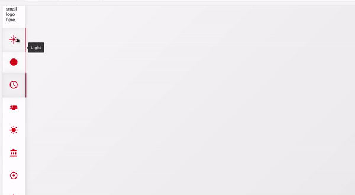

import {Props, Playground} from 'docz'
import Navbar from './src/lib/'

## Introduction

Vertical Navbar is a react component that creates a 
vertical navbar in the left side of the page. 
It behaves completely responsive when accessing it in small devices
transforming the vertical navbar to a horizontal navbar at the bottom of the page.

## Props

<Props of={Navbar}/>

## Usage

